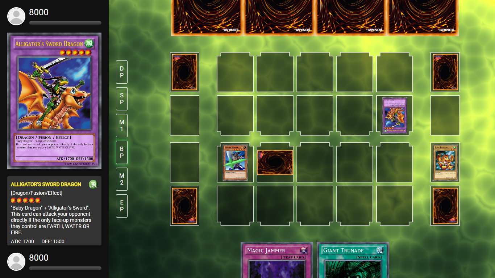

# Duel Arena

Duel Arena is an online implementation of the
[Yu-Gi-Oh! card game](https://en.wikipedia.org/wiki/Yu-Gi-Oh!_Trading_Card_Game).
It offers both human-vs-human and human-vs-ai game modes. It also allows players
to select between different playing rules and options.

## Supported browsers
* Chrome version 80.0 or above
* Firefox version 68 or above
* Edge Anaheim or later

## Current issues
You can find information about current and resolved issues in the [ISSUES file](ISSUES.txt).

## Run locally
To run the app locally, [download the source code]() or clone the repository and open index.html
in a supported browser.

## Contribute
To contribute source code or fix issues, submit a pull request while indicating clearly the
intent of the request (bug fix, new feature, etc...).